# Grad-CAM Visualization Report

Model: **psa_eca_resnet**

Split used: **test**

Samples generated: **42**

Correct predictions in sampled images: **28/42**

Output folder: `reports/gradcam/psa_eca_resnet/test`

## What This Shows

Grad-CAM highlights image regions that most influenced the model's predicted class.

Red/yellow areas mean stronger influence. Blue areas mean weaker influence.

For this project, Grad-CAM helps check whether the model is looking at the skin lesion or disease-affected region instead of unrelated background, ruler marks, image borders, hair, lighting, or text artifacts.

## Important Limitation

Grad-CAM is an explanation tool, not proof that the model is medically correct. It should be used together with metrics, confusion matrices, and mentor/clinical review.

## Sample Visualizations

### acne_vulgaris | predicted: acne_vulgaris | confidence: 59.58%

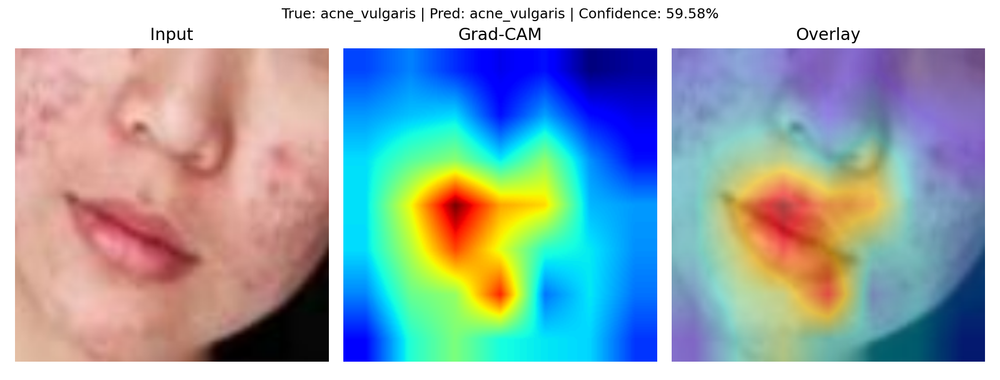
### acne_vulgaris | predicted: fungal_nail_infections | confidence: 28.22%

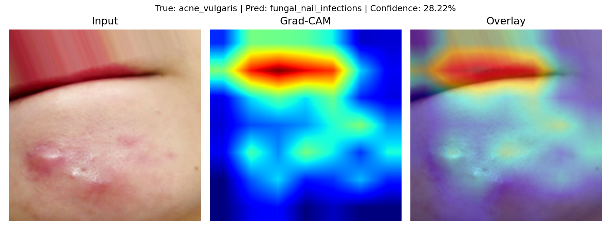
### acne_vulgaris | predicted: acne_vulgaris | confidence: 87.79%

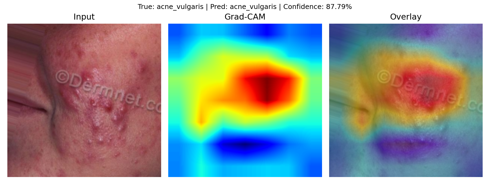
### atopic_dermatitis | predicted: atopic_dermatitis | confidence: 50.38%

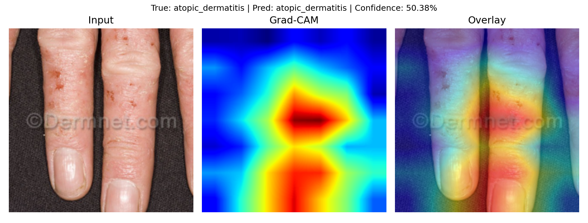
### atopic_dermatitis | predicted: contact_dermatitis | confidence: 78.45%

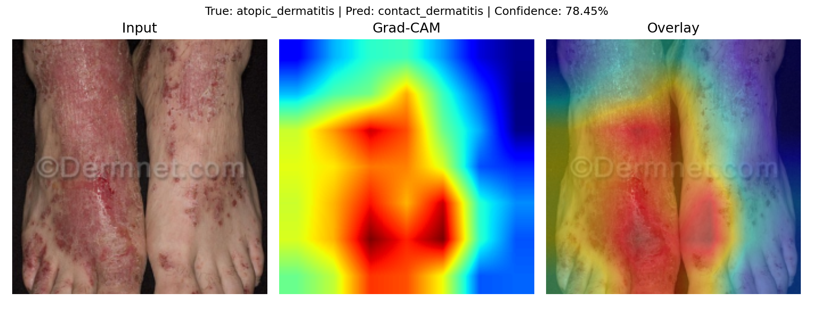
### atopic_dermatitis | predicted: atopic_dermatitis | confidence: 51.40%

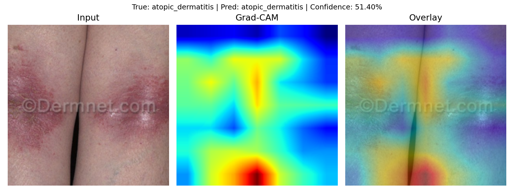
### basal_cell_carcinoma | predicted: basal_cell_carcinoma | confidence: 90.88%

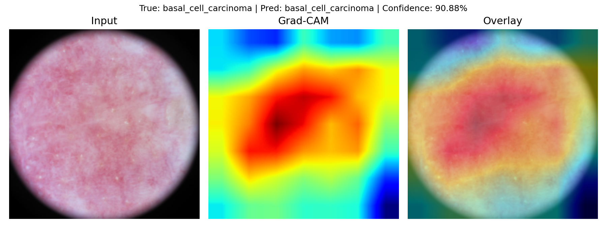
### basal_cell_carcinoma | predicted: basal_cell_carcinoma | confidence: 92.50%

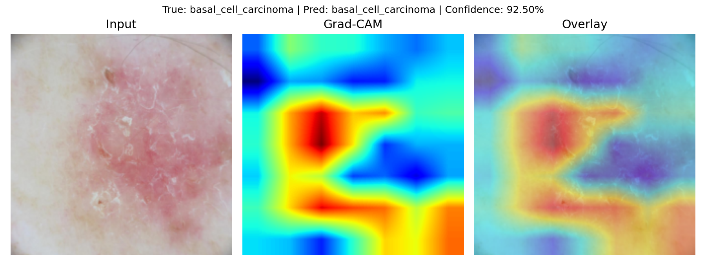
### basal_cell_carcinoma | predicted: basal_cell_carcinoma | confidence: 86.14%

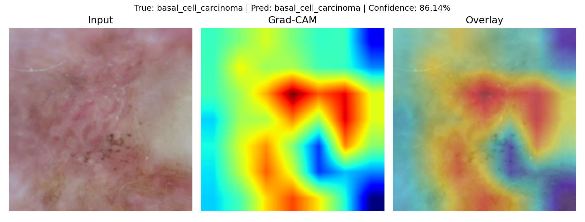
### contact_dermatitis | predicted: contact_dermatitis | confidence: 99.98%

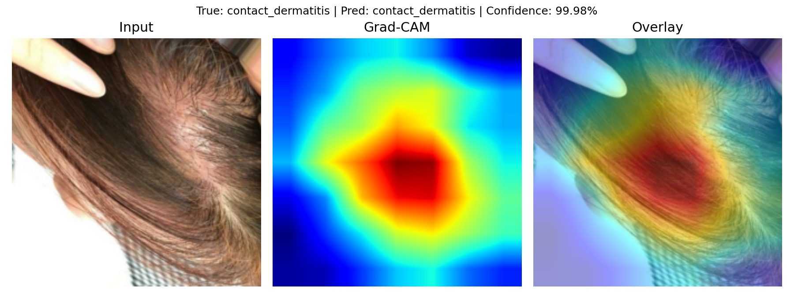
### contact_dermatitis | predicted: plaque_psoriasis | confidence: 49.01%

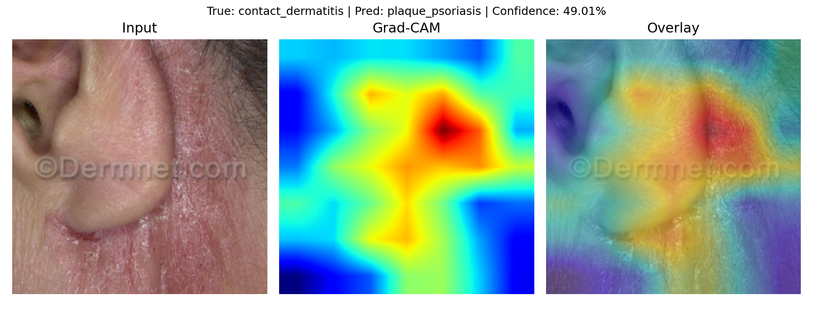
### contact_dermatitis | predicted: contact_dermatitis | confidence: 99.68%

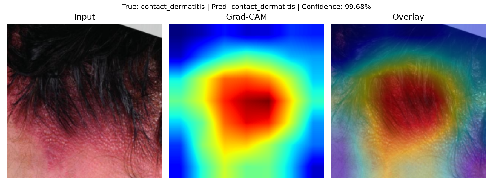

## Saved Files

- Metadata CSV: `reports/gradcam/psa_eca_resnet/test/gradcam_metadata.csv`
- Individual Grad-CAM images: `reports/gradcam/psa_eca_resnet/test`
