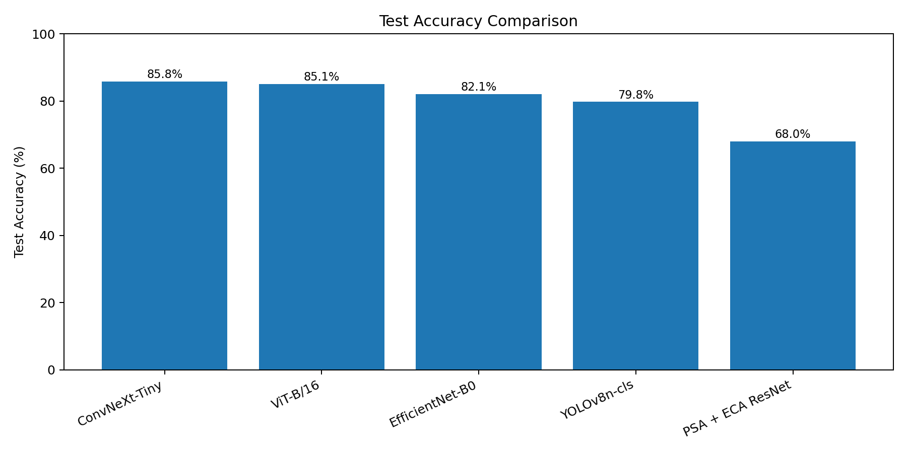
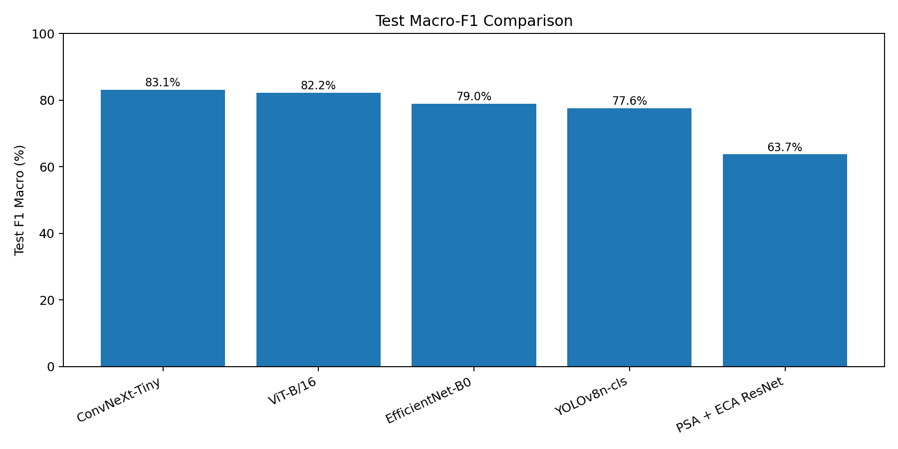
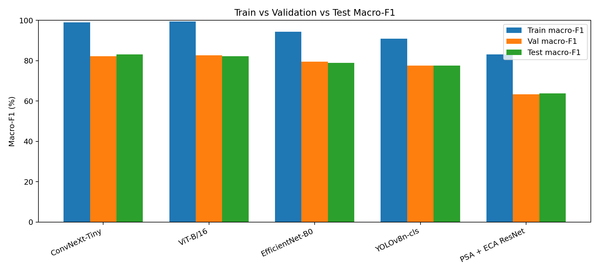
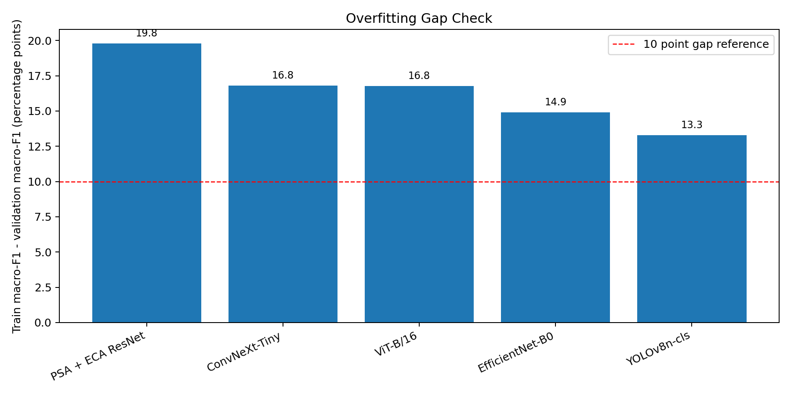
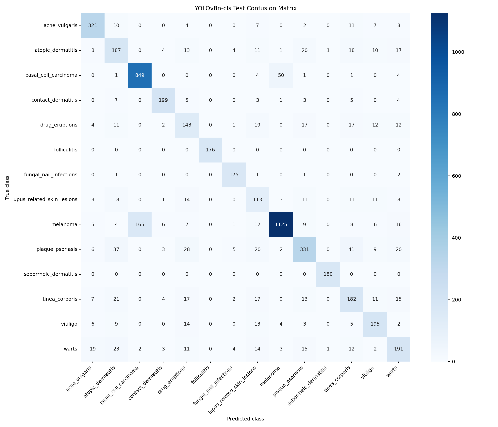
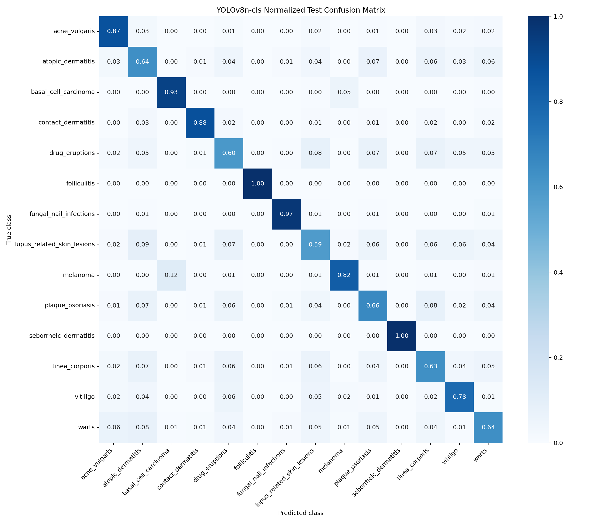

# Overall Model Comparison Summary

Generated on: 2026-07-02

## Dataset Used

- Project folder: `/backup/Intern/combine_skindiseaseclassifier_devraj`
- Dataset folder: `data/selected_images`
- Split folder: `data/splits`
- Total images: **36,528**
- Total classes: **14**
- Split rule: **70% train / 15% validation / 15% test**
- Train images: **25,576**
- Validation images: **5,478**
- Test images: **5,474**
- Leakage prevention: perceptual-hash group IDs were kept in only one split.

## Preprocessing And Balancing

- Corrupt/bad files were removed before training.
- Exact duplicate and near-duplicate handling was done before splitting.
- Perceptual-hash grouping was used so similar images do not leak across train, validation, and test.
- PyTorch models used `WeightedRandomSampler` on the training split only.
- PyTorch train-time augmentation used random crop, horizontal flip, small rotation, mild color jitter, and ImageNet normalization.
- PyTorch validation/test used deterministic resize, center crop, and ImageNet normalization.
- YOLO used a separate classification folder at `data/yolo_cls_balanced`; only its train split was balanced using symlinks, while validation and test stayed natural.

## Main Comparison Table

| Model | Best Epoch | Train Acc | Train Macro-F1 | Val Acc | Val Macro-F1 | Test Acc | Test Precision | Test Recall | Test Macro-F1 | Test Weighted-F1 | Train-Val F1 Gap |
| --- | --- | --- | --- | --- | --- | --- | --- | --- | --- | --- | --- |
| ConvNeXt-Tiny | 12 | 99.00% | 99.00% | 85.27% | 82.19% | 85.84% | 83.07% | 83.26% | 83.09% | 85.83% | 16.81% |
| ViT-B/16 | 10 | 99.44% | 99.45% | 85.43% | 82.67% | 85.06% | 82.45% | 82.33% | 82.21% | 84.94% | 16.78% |
| EfficientNet-B0 | 12 | 94.40% | 94.38% | 82.44% | 79.46% | 82.12% | 78.62% | 79.58% | 78.95% | 82.17% | 14.92% |
| YOLOv8n-cls | 12 | 90.92% | 90.91% | 80.30% | 77.63% | 79.78% | 76.99% | 78.57% | 77.62% | 79.99% | 13.28% |
| PSA + ECA ResNet | 12 | 83.15% | 83.08% | 67.73% | 63.29% | 67.99% | 63.29% | 64.54% | 63.73% | 68.40% | 19.79% |

## Best Model Finding

**ConvNeXt-Tiny** is currently the best overall model because it has the highest test macro-F1 (83.09%) and also the highest test accuracy among the models with full precision/recall/F1 metrics (85.84%).

For this skin disease classification task, the most important comparison metric is **macro-F1**, followed by **macro recall** and the **normalized confusion matrix**. Accuracy is useful, but it can hide weak performance on smaller disease classes.

## Ranking By Test Macro-F1

| Ranked Model | Test Macro-F1 | Test Macro Recall | Test Accuracy |
| --- | --- | --- | --- |
| ConvNeXt-Tiny | 83.09% | 83.26% | 85.84% |
| ViT-B/16 | 82.21% | 82.33% | 85.06% |
| EfficientNet-B0 | 78.95% | 79.58% | 82.12% |
| YOLOv8n-cls | 77.62% | 78.57% | 79.78% |
| PSA + ECA ResNet | 63.73% | 64.54% | 67.99% |

## Ranking By Test Accuracy

| Ranked Model | Test Accuracy | Test Macro-F1 | Note |
| --- | --- | --- | --- |
| ConvNeXt-Tiny | 85.84% | 83.09% | Full train/val/test precision, recall, F1, loss available. |
| ViT-B/16 | 85.06% | 82.21% | Full train/val/test precision, recall, F1, loss available. |
| EfficientNet-B0 | 82.12% | 78.95% | Full train/val/test precision, recall, F1, loss available. |
| YOLOv8n-cls | 79.78% | 77.62% | YOLO train/val/test metrics were computed from exported predictions. Train split is balanced with symlinks, so train metrics are useful for overfitting check but not a natural-data score. |
| PSA + ECA ResNet | 67.99% | 63.73% | Full train/val/test precision, recall, F1, loss available. |

## Graph Summary

## Confusion Matrix Comparison

The normal confusion matrix shows the number of images predicted in each class. The normalized confusion matrix shows percentages, which is easier for checking which disease classes are being confused.

### PSA + ECA ResNet

Per-class classification report: `training_outputs/psa_eca_resnet/psa_eca_resnet_fixed_12ep_20260630_042833/classification_report.txt`
Run folder: `training_outputs/psa_eca_resnet/psa_eca_resnet_fixed_12ep_20260630_042833`
### EfficientNet-B0

Per-class classification report: `training_outputs/pretrained_cnns/efficientnet_b0/efficientnet_b0_fixed_12ep_20260630_091338/classification_report.txt`
Run folder: `training_outputs/pretrained_cnns/efficientnet_b0/efficientnet_b0_fixed_12ep_20260630_091338`
### ConvNeXt-Tiny

Per-class classification report: `training_outputs/pretrained_cnns/convnext_tiny/convnext_tiny_fixed_12ep_20260701_070637/classification_report.txt`
Run folder: `training_outputs/pretrained_cnns/convnext_tiny/convnext_tiny_fixed_12ep_20260701_070637`
### ViT-B/16

Per-class classification report: `training_outputs/vit/vit_b_16/vit_b_16_fixed_12ep_20260702_070652/classification_report.txt`
Run folder: `training_outputs/vit/vit_b_16/vit_b_16_fixed_12ep_20260702_070652`
### YOLOv8n-cls

Per-class classification report: `reports/yolo_training/full_split_metrics/test/yolo_test_classification_report.txt`
Run folder: `training_outputs/yolo/yolov8n_cls_fixed_12ep_20260701_121336`

## Overfitting Interpretation

- A large gap between train macro-F1 and validation macro-F1 means the model is learning the training images much better than unseen validation images.
- ConvNeXt-Tiny has the highest performance, but its train macro-F1 is much higher than validation/test macro-F1, so it should be watched for overfitting.
- EfficientNet-B0 is also strong and slightly lighter than ConvNeXt-Tiny.
- PSA+ECA ResNet is weaker in this run and may need better tuning, stronger regularization, or more epochs with a staged training strategy.
- YOLOv8n-cls now has full test precision, recall, macro-F1, weighted-F1, top-1 accuracy, top-5 accuracy, and confusion matrices, so it can be compared more fairly with the PyTorch models.

## Metrics To Prioritize For Skin Disease Classification

1. **Macro-F1**: treats every disease class equally, even when some classes have fewer images.
2. **Macro recall**: important because missing a disease class can be more serious than a simple wrong prediction.
3. **Per-class recall/F1**: shows which exact diseases are weak.
4. **Normalized confusion matrix**: shows which diseases are confused with each other.
5. **Test accuracy**: useful as a general score, but not enough alone.
6. **Train vs validation gap**: helps detect overfitting.

## Recommended Next Improvements

- Review ViT-B/16 attention visualizations and compare them with CNN Grad-CAM outputs.
- Try ConvNeXt-Tiny final run with careful regularization and monitor the train-validation gap.
- Review confused class pairs from the confusion matrix and clean labels where diseases look visually similar.
- Try focal loss or class-balanced loss if smaller classes still have weak recall.
- Use grouped k-fold validation later for a stronger research-style evaluation.
- Validate on an external dataset if available, because external testing is the best check for real generalization.

## Saved Comparison Files

- CSV metrics table: `reports/model_comparison/model_comparison.csv`
- Test accuracy graph: `reports/model_comparison/test_accuracy_comparison.png`
- Test macro-F1 graph: `reports/model_comparison/test_macro_f1_comparison.png`
- Train/validation/test macro-F1 graph: `reports/model_comparison/train_val_test_macro_f1.png`
- Overfitting gap graph: `reports/model_comparison/overfitting_gap_comparison.png`
