# ViT-B/16 Attention Visualization Report

Model: **ViT-B/16**

Checkpoint: `training_outputs/vit/vit_b_16/vit_b_16_fixed_12ep_20260702_070652/best_model.pth`

Split used: **test**

Samples generated: **42**

Correct predictions in sampled images: **21/42**

Output folder: `reports/attention/vit_b_16/test`

## What This Shows

This is **attention rollout**, not standard CNN Grad-CAM.

ViT-B/16 splits each image into 16x16 patches. Attention rollout follows how the class token attends to image patches across the transformer layers.

Red/yellow areas mean patches that had stronger influence on the final image-level prediction. Blue areas mean weaker influence.

## Why This Is Useful

It helps check whether ViT is focusing on disease-affected skin regions instead of background, borders, lighting, text artifacts, or unrelated objects.

## Important Limitation

Attention visualization is an explanation aid, not proof of medical correctness. Use it together with metrics, confusion matrices, and mentor review.

## Sample Visualizations

### acne_vulgaris | predicted: acne_vulgaris | confidence: 52.70%

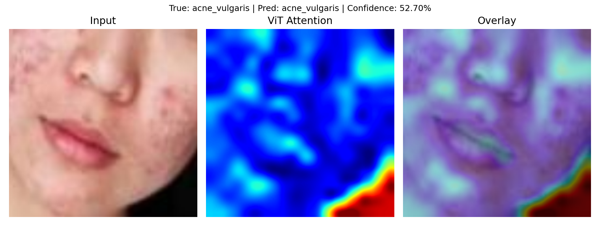
### acne_vulgaris | predicted: warts | confidence: 32.57%

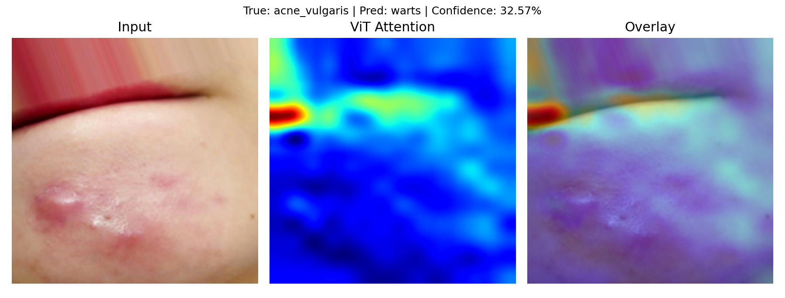
### acne_vulgaris | predicted: acne_vulgaris | confidence: 30.36%

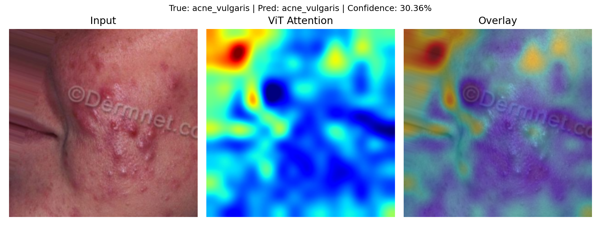
### atopic_dermatitis | predicted: atopic_dermatitis | confidence: 69.61%

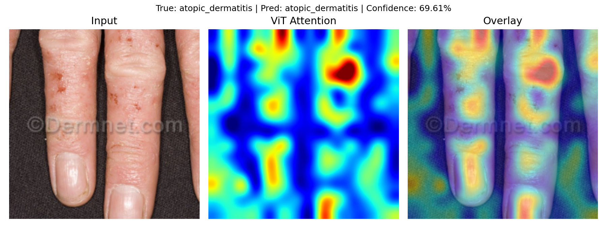
### atopic_dermatitis | predicted: contact_dermatitis | confidence: 33.34%

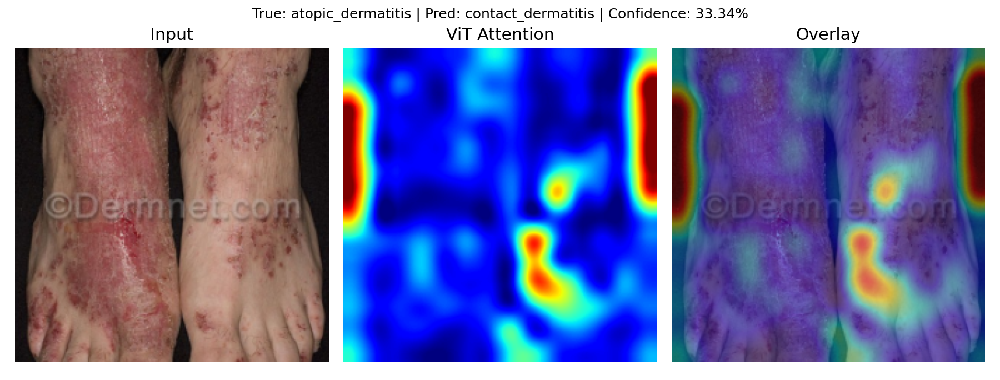
### atopic_dermatitis | predicted: tinea_corporis | confidence: 58.25%

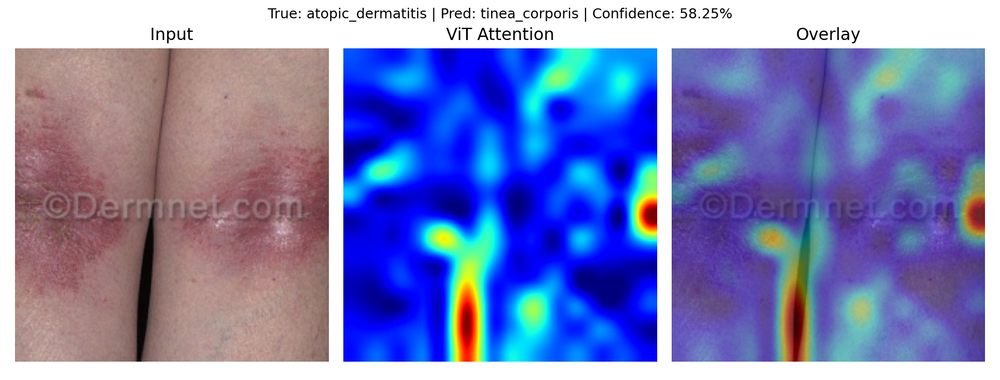
### basal_cell_carcinoma | predicted: melanoma | confidence: 30.93%

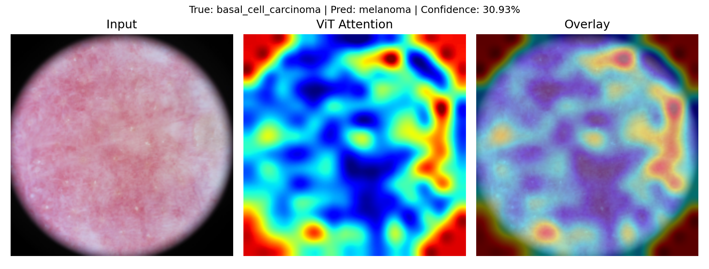
### basal_cell_carcinoma | predicted: basal_cell_carcinoma | confidence: 62.45%

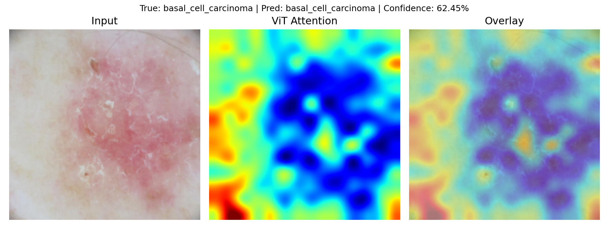
### basal_cell_carcinoma | predicted: melanoma | confidence: 51.86%

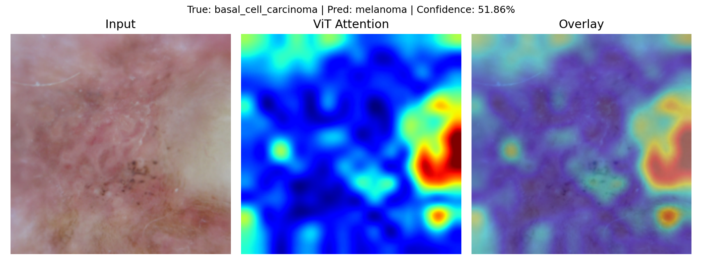
### contact_dermatitis | predicted: contact_dermatitis | confidence: 79.93%

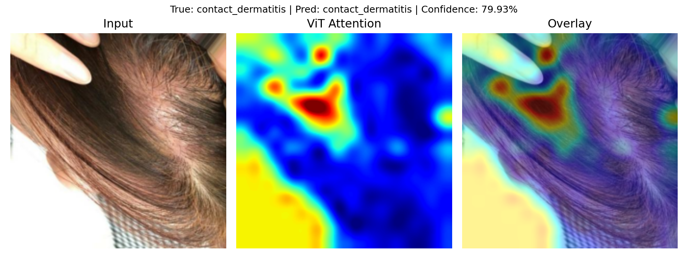
### contact_dermatitis | predicted: lupus_related_skin_lesions | confidence: 38.45%

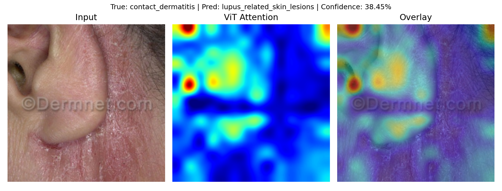
### contact_dermatitis | predicted: contact_dermatitis | confidence: 72.90%

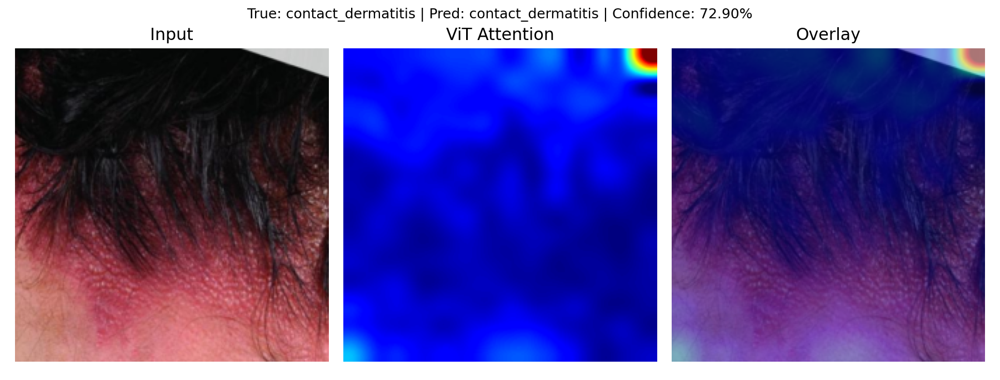

## Saved Files

- Metadata CSV: `reports/attention/vit_b_16/test/vit_attention_metadata.csv`
- Individual attention images: `reports/attention/vit_b_16/test`
